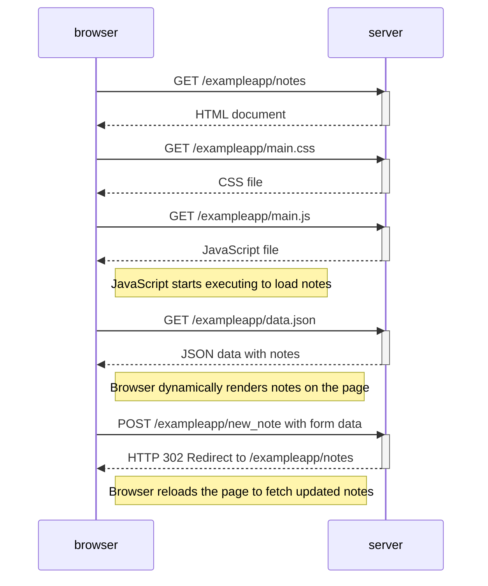

```mermaid

sequenceDiagram
    participant browser
    participant server

    browser->>server: GET /exampleapp/notes
    activate server
    server-->>browser: HTML document
    deactivate server

    browser->>server: GET /exampleapp/main.css
    activate server
    server-->>browser: CSS file
    deactivate server

    browser->>server: GET /exampleapp/main.js
    activate server
    server-->>browser: JavaScript file
    deactivate server

    Note right of browser: JavaScript starts executing to load notes

    browser->>server: GET /exampleapp/data.json
    activate server
    server-->>browser: JSON data with notes
    deactivate server

    Note right of browser: Browser dynamically renders notes on the page

    browser->>server: POST /exampleapp/new_note with form data
    activate server
    server-->>browser: HTTP 302 Redirect to /exampleapp/notes
    deactivate server

    Note right of browser: Browser reloads the page to fetch updated notes

```