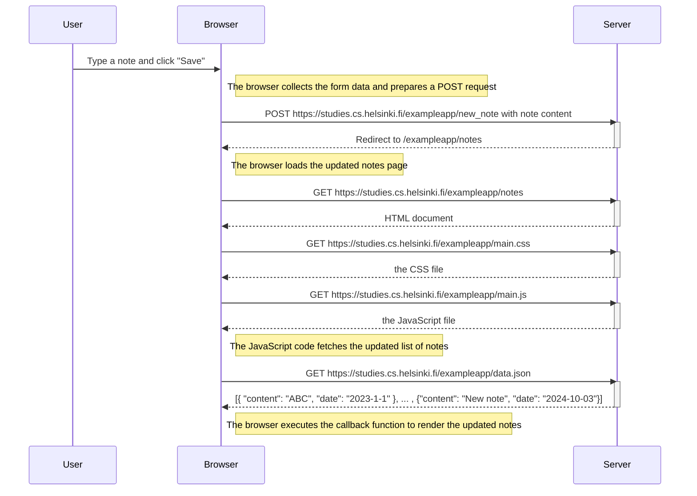

```mermaid

sequenceDiagram
    participant User
    participant Browser
    participant Server

    User->>Browser: Type a note and click "Save"
    Note right of Browser: The browser collects the form data and prepares a POST request
    Browser->>Server: POST https://studies.cs.helsinki.fi/exampleapp/new_note with note content
    activate Server
    Server-->>Browser: Redirect to /exampleapp/notes
    deactivate Server

    Note right of Browser: The browser loads the updated notes page

    Browser->>Server: GET https://studies.cs.helsinki.fi/exampleapp/notes
    activate Server
    Server-->>Browser: HTML document
    deactivate Server

    Browser->>Server: GET https://studies.cs.helsinki.fi/exampleapp/main.css
    activate Server
    Server-->>Browser: the CSS file
    deactivate Server

    Browser->>Server: GET https://studies.cs.helsinki.fi/exampleapp/main.js
    activate Server
    Server-->>Browser: the JavaScript file
    deactivate Server

    Note right of Browser: The JavaScript code fetches the updated list of notes

    Browser->>Server: GET https://studies.cs.helsinki.fi/exampleapp/data.json
    activate Server
    Server-->>Browser: [{ "content": "ABC", "date": "2023-1-1" }, ... , {"content": "New note", "date": "2024-10-03"}]
    deactivate Server

    Note right of Browser: The browser executes the callback function to render the updated notes

```
