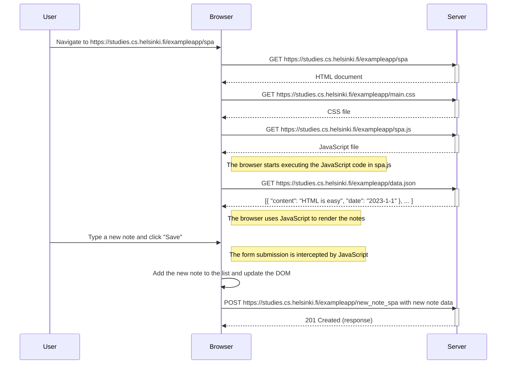

```mermaid
sequenceDiagram
    participant User
    participant Browser
    participant Server

    User->>Browser: Navigate to https://studies.cs.helsinki.fi/exampleapp/spa
    Browser->>Server: GET https://studies.cs.helsinki.fi/exampleapp/spa
    activate Server
    Server-->>Browser: HTML document
    deactivate Server

    Browser->>Server: GET https://studies.cs.helsinki.fi/exampleapp/main.css
    activate Server
    Server-->>Browser: CSS file
    deactivate Server

    Browser->>Server: GET https://studies.cs.helsinki.fi/exampleapp/spa.js
    activate Server
    Server-->>Browser: JavaScript file
    deactivate Server

    Note right of Browser: The browser starts executing the JavaScript code in spa.js

    Browser->>Server: GET https://studies.cs.helsinki.fi/exampleapp/data.json
    activate Server
    Server-->>Browser: [{ "content": "HTML is easy", "date": "2023-1-1" }, ... ]
    deactivate Server

    Note right of Browser: The browser uses JavaScript to render the notes

    User->>Browser: Type a new note and click "Save"
    Note right of Browser: The form submission is intercepted by JavaScript

    Browser->>Browser: Add the new note to the list and update the DOM

    Browser->>Server: POST https://studies.cs.helsinki.fi/exampleapp/new_note_spa with new note data
    activate Server
    Server-->>Browser: 201 Created (response)
    deactivate Server

```
