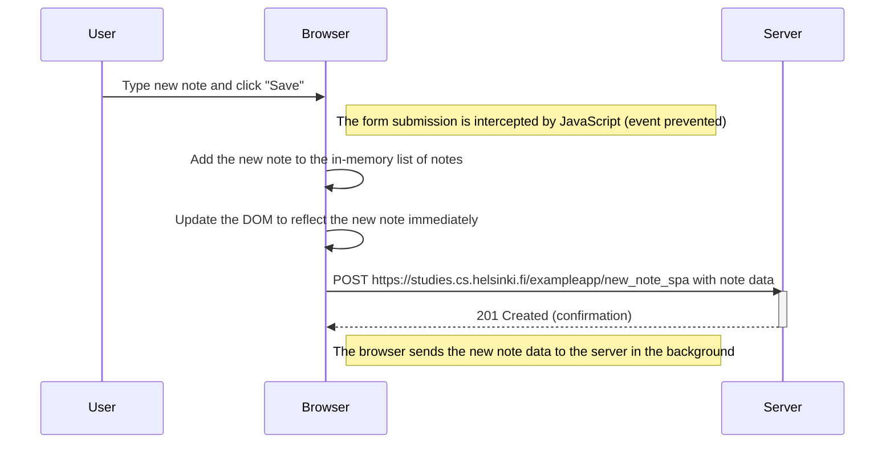

```mermaid
sequenceDiagram
    participant User
    participant Browser
    participant Server

    User->>Browser: Type new note and click "Save"
    Note right of Browser: The form submission is intercepted by JavaScript (event prevented)

    Browser->>Browser: Add the new note to the in-memory list of notes
    Browser->>Browser: Update the DOM to reflect the new note immediately

    Browser->>Server: POST https://studies.cs.helsinki.fi/exampleapp/new_note_spa with note data
    activate Server
    Server-->>Browser: 201 Created (confirmation)
    deactivate Server

    Note right of Browser: The browser sends the new note data to the server in the background

```
